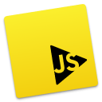
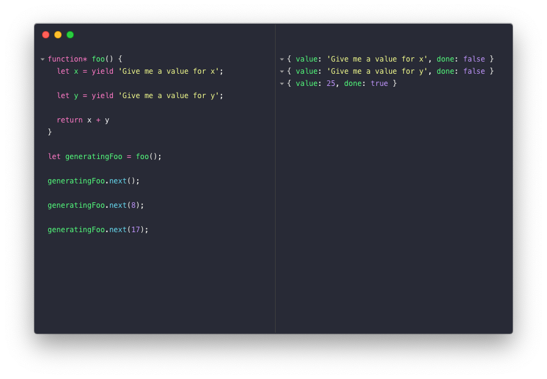

# [RunJS](https://runjs.app)

Download the latest release [here](https://github.com/lukehaas/runjs/releases).

RunJS is an JavaScript playground that auto-evaluates your code as you type and outputs the results to a console pane.

TypeScript and modern JavaScript features are supported through Babel transpilation. Additionally, Node and browser APIs are available.

## Acknowledgements

RunJS icon designed by Giuseppe Caruso
