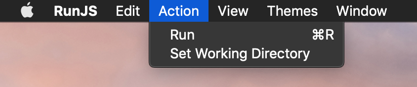
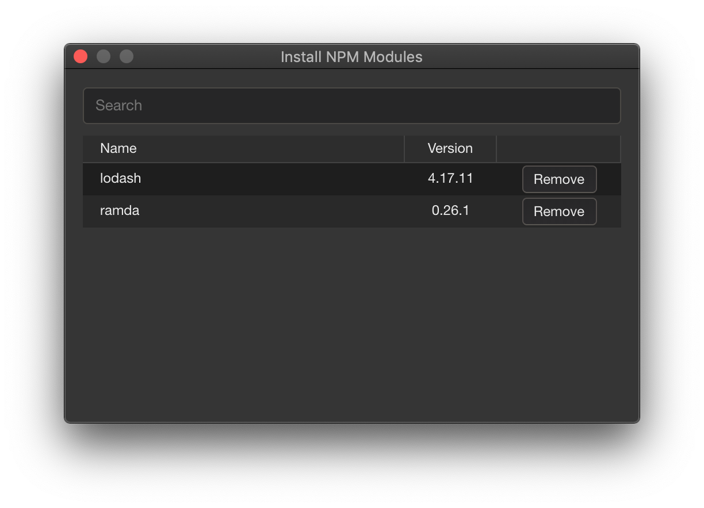
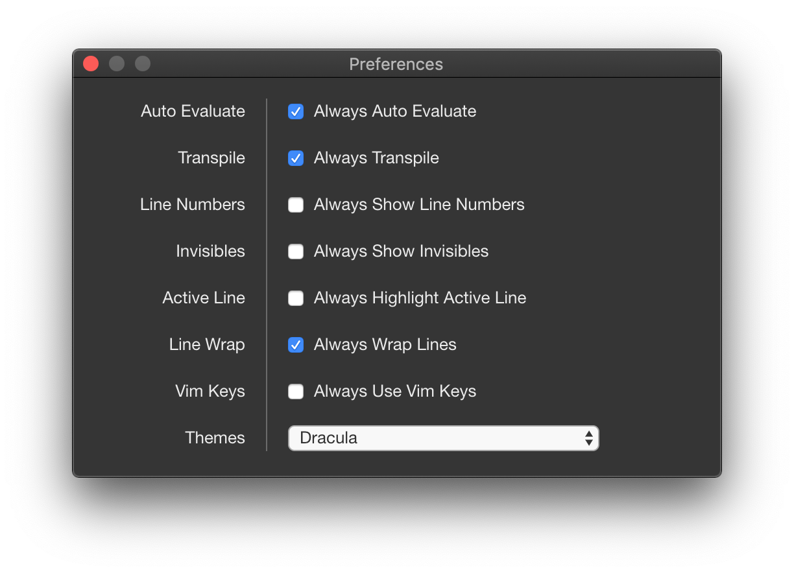

# RunJS

Download the latest release [here](https://github.com/lukehaas/runjs/releases).

RunJS is an JavaScript playground that auto-evaluates your code as you type and outputs the results to a console pane.

## Features

TypeScript and modern JavaScript features are supported through Babel transpilation. Additionally, Node and browser APIs are available.

RunJS can import node packages from existing JavaScript projects by pointing it's working directory to your chosen project directory.

Node packages can also be installed directly through this window, opened from the `Action` menu.

RunJS also has a number of configurable options, accessed via the preferences window.

RunJS executes JavaScript against the following versions of Node, V8 and Chromium:

- Node: 12.4.0
- V8: 7.6.303.29-electron.0
- Chromium: 76.0.3809.88

## Acknowledgements

RunJS icon designed by Giuseppe Caruso