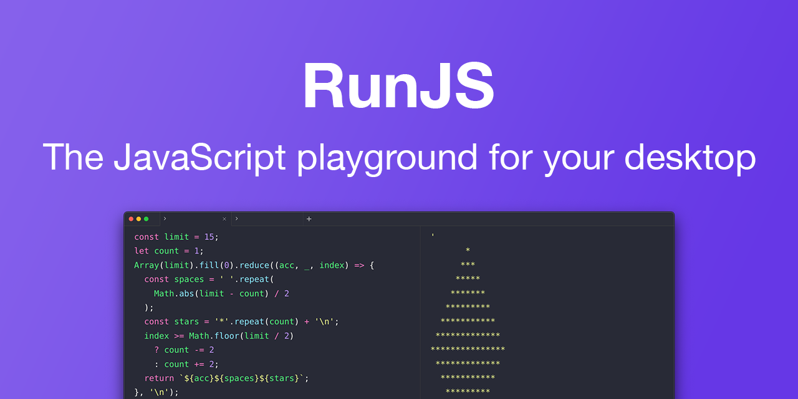

  <a href="https://runjs.app">
    
    <h1 align="center">RunJS</h1>
  </a>

[RunJS](https://runjs.app) is a playground for JavaScript and TypeScript. It runs your code automatically and shows you instant results.

## Why RunJS?

- An isolated space to run code experiments 🔬
- Great for learning and teaching 🧑‍🏫
- Support for code completion, type checking and documentation on hover ⚡️
- Easily install NPM packages 🚀
- Save snippets and build a snippet library 🧑‍💻
- Includes access to Node.js and Browser APIs 🖥️

Download the latest release [here](https://runjs.app/releases/latest).

## Links
- [Website](https://runjs.app)
- [Documentation](https://runjs.app/docs)
- [Issue tracker](https://github.com/lukehaas/RunJS/issues)
- [Support](mailto:mail@runjs.app)

## Feature Highlights

- [TypeScript Playground](https://runjs.app/typescript-playground)
- [JavaScript Compiler](https://runjs.app/javascript-compiler)

## Acknowledgements

RunJS icon designed by Giuseppe Caruso
